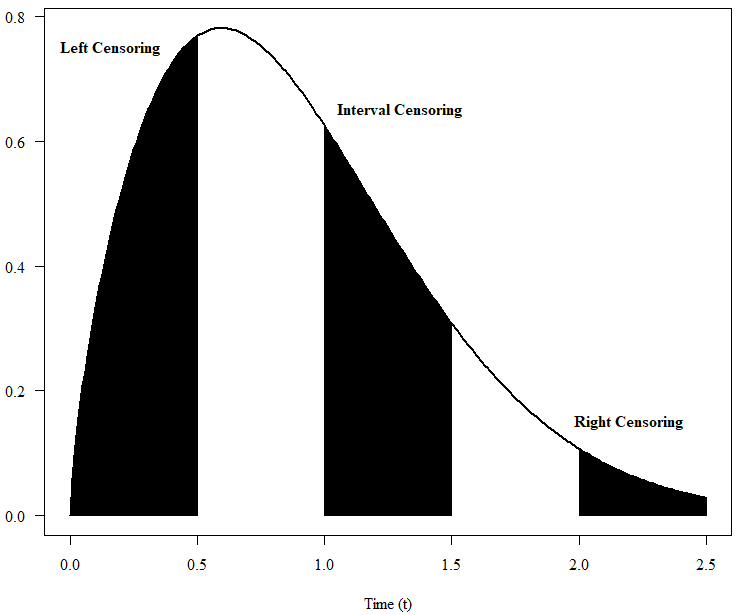

class: inverse, left, bottom, hide_logo
<!--background-image: url("images/U.S.-Air-Force.jpg")-->
<!-- background-image: url("images/rso.png") -->
<!-- background-position: top, left -->
<!-- background-size: 50 -->

# Introduction to Weibull Analysis

## `r format(Sys.Date(), '%d %b %Y')`

```{r setup, include=FALSE, cache=FALSE}
# Set global R options
options(htmltools.dir.version = FALSE, servr.daemon = TRUE)
# Set global knitr chunk options
knitr::opts_chunk$set(
  fig.align = "center",
  cache = !TRUE,
  error = FALSE,
  message = FALSE,
  warning = FALSE,
  collapse = TRUE ,
  echo = F
)
# set ggplot to black and white theme
library(highcharter)
library(xaringanExtra)
xaringanExtra::use_panelset()
library(ggplot2)
library(plotly)
library(SMRD)
theme_set(theme_bw())
#library(SMRD)
root = rprojroot::find_root(rprojroot::is_git_root)
```

```{r xaringan-logo, echo=FALSE, eval=FALSE}
xaringanExtra::use_logo(
  image_url = "https://pbs.twimg.com/profile_images/1242553053519073281/X2fHgMX9_400x400.jpg",
  width = "60px",
  height = "60px",
  position = css_position(bottom = "2em", right = "0.75em"),
  exclude_class = c("hide_logo")
)
```


```{css, include=F}
red{color: red;
    font-weight: bold;}
```

```{r, eval=FALSE, include=FALSE}
## Linear plots
xlines = c(seq(1,9,1),
           seq(10,90,10),
           seq(100,900,100),
           seq(1000,9000,1000),
           seq(10000,90000,10000))

xvals = c(seq(1,5,1),
          seq(10,50,10),
          seq(100,500,100),
          seq(1000,5000,1000),
          seq(10000,50000,10000))

ylines = c(seq(.0001,.0009,.0001),
         seq(.001,.009,.001),
         seq(.01,.09,.01),
         seq(.1,.9,.1),
         .95,.99,.995,.999,.9995,.9999,.632)

yvals = c(.0001,.0005,.001,.005,.01,.05,.1,
          .5,.9,.95,.99,.995,.999,.9995,.9999,.632)

.fun = function(x,y,params){

  return(sum((y - (params[1] * (x - log(params[2]))))**2))

}
```

```{r, eval=!FALSE, include=FALSE}
risk_set = 150
shape = 4.2
scale = 5.7
shape2 = 0.943
scale2 = 1754
N1 = 17
N2 = risk_set - N1

obs1 = rweibull(N1, shape = shape, scale = scale)
obs2 = rweibull(N2, shape = shape2, scale = scale2)

obs = sort(c(obs1, obs2))
ranks = rank(obs)
```

```{r, eval=FALSE, include=FALSE}
df = data.frame(event = 0,
                n_fails = 0,
                time = 0,
                at_risk = risk_set,
                median_ranks = 0,
                km_raw = 1,
                kaplan_meier = 1)

for(i in 1:length(obs)) {

    event = df$event[i] + 1
    fails = length(which(obs == obs[i]))
    km_raw = 1 - (fails / df$at_risk[i])
    km = km_raw * df$kaplan_meier[i]
    mr = (ranks[i] - 0.3) / (length(obs) + 0.4)

    df = rbind(df, list(event = event,
                        n_fails = fails,
                        time = obs[i],
                        at_risk = df$at_risk[i] - fails,
                        median_ranks = mr,
                        km_raw = km_raw,
                        kaplan_meier = km))
}

N  = nrow(df)
x  = log(df$time)[-c(1,N)]
y1 = log(log(1/df$kaplan_meier))[-c(1,N)]
y2 = log(log(1/(1-df$median_ranks)))[-c(1,N)]
```

```{r, message=FALSE, results='hide', eval=FALSE, include=FALSE}
f1 = optim(par = c(1.2,3000),
      fn = .fun,
      x = x, y = y1)
f2 = optim(par = c(1.2,3000),
      fn = .fun,
      x = x, y = y2)
f3 <- fitdistrplus::fitdist(obs, distr = "weibull")

t1 = qweibull(0.2,sh = f3$e[1],   sc = f3$e[2])
t2 = qweibull(0.2,sh = f1$par[1], sc = f1$par[2])
tr = (t1 - t2)/ t1

z = qnorm(0.975)
t_e = log(obs)
mu = log(f3$estimate[2])
sigma = 1/f3$estimate[1]
zi = (t_e - mu) / sigma
var_mu = f3$vcov[2,2] / exp(mu)**2
var_sigma = f3$vcov[1,1] / (1/sigma)**4
cov_mu_sig = f3$vcov[1,2] / ( exp(mu) * -1*(1/sigma**2))
F_hat = SMRD::psev(t_e, location = mu, scale = sigma)

se_F = (SMRD::dsev(zi) / sigma) * sqrt(var_mu + 2* zi* cov_mu_sig + (zi**2)*var_sigma)
w = exp((z * se_F)/ (F_hat*(1-F_hat)))
F_up = F_hat / (F_hat + (1-F_hat) * w)
F_dn = F_hat / (F_hat + (1-F_hat) / w)
```

---
## Introduction

Weibull Analysis is a family of graphical and statistical techniques used estimate important life characteristics of a product by fitting a parameterized probability distribution to life data

This presentation introduces several aspects of Weibull analysis and how they are implemented on various types of reliability data

- The Weibull distribution

    + Background, properties, and importance
    + Distribution functions
    + Parameters: shape $\beta$, scale $\eta$, location $\theta$
    + Relationship to other distributions

- Weibull probability plots

    + Constructing the plot
    + Plotting the observed events
    + Fitting the Weibull model and estimating parameters

$$\newcommand\redbf[1]{\color{red}{\boldsymbol{#1}}}$$
$$\newcommand\mbf[1]{{\boldsymbol{#1}}}$$
$$\newcommand\greenbf[1]{\color{green}{\boldsymbol{#1}}}$$
$$\newcommand\bluebf[1]{\color{blue}{\boldsymbol{#1}}}$$
$$\newcommand\purplebf[1]{\color{purple}{\boldsymbol{#1}}}$$

---
## About this presentation

.panelset[.panel[.panel-name[Navigating this presentation]

.pull-left[

Note the navbar above `r fontawesome::fa_i("hand-point-up", class="faa-bounce animated")` 

+ Several slides in this presentation include panels that contain more information about a topic
+ Depending on the browser you're using, the left and right arrow keys may be used to navigate the panels 
+ Otherwise, you can click the panel title to view the content on that panel

This presentation also includes interactive elements

+ <span class="explain">Hoverable text tooltips</span><span class="tooltip">When you hover over these text elements a pop-up window appears to show additional information</span> are shown using red-ish text and a dotted underline
+ many of the graphs are also interactive, like the one shown to the right these graphs provide additional data when you hover over them

]

.pull-right[

<iframe src="images/p.html" width="100%" height="400" id="igraph" scrolling="no" seamless="seamless" frameBorder="0"></iframe>

]

.panel[.panel-name[Details about this presentation]

This is an HTML presentation created using the <a target=" " href="https://remarkjs.com/#1">Remarkjs</a> slideshow framework along with the following resources

- <a target=" " href="https://rmarkdown.rstudio.com/">RMarkdown</a>
- <a target=" " href="https://www.mathjax.org/">MathJax</a>
- <a target=" " href="https://plotly.com/">Plotly</a>
- <a target=" " href="https://imagemagick.org/index.php">Image Magick</a>
- <a target=" " href="https://imagemagick.org/index.php">Font Awesome</a>

The open-source code used to create these slides can be accessed from <a target=" " href="https://github.com/Auburngrads/weibull_analysis">this Github repo</a>

Upon accessing this presentation, several server-side resources may take a few seconds to fully load - if things don't render properly or if you find an error, please <a target=" " href="https://github.com/Auburngrads/weibull_analysis/issues/new/choose">create an issue</a> 

]
]
]

---
class: inverse, left, bottom, hide_logo

# The Weibull Distribution

---
## Background of the Weibull Distribution 

.pull-left[

The distribution is named after Ernst Hjalmar Waloddi Weibull (1887–1979), the <span class="explain">Swedish</span><span class="tooltip">As a Swede, his surname should be pronounced as "Vay-bull" not "Why-bull"</span> engineer, scientist, and mathematician 

The Weibull distribution was actually discovered by the French mathematician Maurice Rene Fréchet in the course of deriving the Fréchet distribution (aka the inverse Weibull distribution)

Weibull popularized his namesake distribution after publishing the <span class="explain">landmark paper</span><span class="tooltip">Weibull, Waloddi. "*A Statistical Distribution Function of Wide Applicability.*" Journal of Applied Mechanics 18 (1951): 293-297.</span> in 1951

+ Weibull had hoped to publish in a prominent mathematics journal, but had to "settle" for an applied engineering journal
+ Initial reaction to the paper was sharply negative
+ In the 1970s, the U.S. Air Force and automotive industry began implementing the distribution and the methods described in the paper
+ Today, Weibull analysis is a foremost method for evaluating life data

]

.pull-right[

<div class="row">
  <div class="column">
    
  </div>
  <div class="column">
    
  </div>
</div>

]

---
## Properties of the Weibull Distribution

The Weibull distribution is a member of a distribution family called "lifetime distributions"

- These distributions describe continuous random variables (R.V.) defined over strictly positive values - $T \in \mathbb{R}^{+}$
- There are many members of the lifetime distribution family (exponential, lognormal, loglogistic, gamma, Birmbaum-Saunders)
- Likewise, there are many distributions that are not members of the lifetime distribution family (normal, logistic, smallest extreme value)

Lifetime distributions have successfully served as population models for failure times arising from a wide range of products and failure mechanisms

- In some cases there are probabilistic arguments based on the physics of failure that justify the choice of a model
- More often, however, the model chosen solely because of its demonstrated success in fitting failure data 
- <u>**This is why the Weibull distribution is so popular**</u> - it's a flexible distribution, capable of fitting many different failure patterns

The Weibull is also a member of the extreme value distribution family

- These models describe the time to failure of the weakest (or strongest) link in a "chain" of components
+ The Weibull is directly related to the smallest extreme value distribution - if $X \sim \text{WEIB}(\eta, \beta)$ then $\log[X] \sim \text{SEV}(\mu, \sigma)$


<!-- The parameterized distribution is used to  such as the probability of failure at a specific time or the failure rate -->

<!-- Weibull Analysis is an effective method of determining reliability characteristics and trends of a population using a relatively small sample size of field or laboratory test data -->

<!-- Life data are time-to-failure (or time-to-event) observations collected from a random sample of items -->

<!-- the practitioner attempts to make predictions about the life of all products in the population by fitting a statistical distribution to life data from a representative sample of units. -->

---
## Distribution Functions - PDF & CDF

```{r, echo=FALSE}
weib_F = "F(t) = 1-\\exp\\left[-\\left(\\frac{t}{\\eta}\\right)^{\\beta}\\right]"
weib_f = "f(t) = \\frac{\\beta}{\\eta}\\left(\\frac{t}{\\eta}\\right)^{\\beta-1}\\exp\\left[-\\left(\\frac{t}{\\eta}\\right)^{\\beta}\\right]"
weib_R = "S(t) = \\exp\\left[-\\left(\\frac{t}{\\eta}\\right)^{\\beta}\\right]"
gen_h = "h(t) = \\lim_{\\Delta t \\to 0} \\frac{\\Pr(t < T \\le t+\\Delta t\\vert T \\ge t)}{\\Delta t}"
weib_h = "$\\displaystyle h(t) = \\frac{\\beta}{\\eta}\\left(\\frac{t}{\\eta}\\right)^{\\beta-1}$"
gen_H = "$\\displaystyle H(t) = \\int_{0}^{t} h(u)du$"
weib_H = "$\\displaystyle H(t) = \\left(\\frac{t}{\\eta}\\right)^{\\beta}$"
weib_q = "t(p) = \\eta\\left(\\ln\\left[\\frac{1}{1 - p}\\right]\\right)^{1/\\beta}"
```

```{r, echo=FALSE}
sh = 2.1
sc = 150
t = seq(0,350, 0.5)
p = pweibull(t, sh = sh, sc = sc)
d = dweibull(t, sh = sh, sc = sc)
s = 1-pweibull(t, sh = sh, sc = sc)
q = qweibull(p, sh = sh, sc = sc)
h = (sh / sc) * (t / sc) ^ (sh - 1)

.DDD <- data.frame(time = rep(t, 5),
                   Func = rep(c("CDF","PDF","Survival","Quantile","Hazard"),each = length(t)),
                   vals = c(p,d,s,q,h)) 
```

.panelset[

.panel[.panel-name[Probability Density Function - PDF]

.pull-left[

```{r, echo=FALSE}
highchart() %>%
  hc_add_series(data = dplyr::filter(.DDD,Func == "PDF"),
                type = "line",mapping = hcaes(x = time, y = vals), name = "CDF", tooltip = list(pointFormat = "f(t): {point.vals}")) %>%
  hc_xAxis(type = 'linear', 
           crosshair = T, 
           title = list(text = "Time t")) %>%
  hc_yAxis(type = "linear", 
           crosshair = T, 
           title = list(text = "f(t)")) 
```

]

.pull-right[

The probability density function (aka density function, or just density) defines the probability that the R.V. <span class="mjx-char MJXc-TeX-math-I" style="display:inline;">T</span> is equal to <span class="mjx-char MJXc-TeX-math-I" style="display:inline;">t</span>.

$$
f(t) = \Pr(T = t)
$$   

The PDF for the Weibull distribution is expressed as 

$$
`r weib_f`
$$

] <!--end .pull-right -->
]

.panel[.panel-name[Cumulative Distribution Function - CDF]

.pull-left[

```{r, echo=FALSE}
highchart() %>%
  hc_add_series(data = dplyr::filter(.DDD,Func == "CDF"),
                type = "line",mapping = hcaes(x = time, y = vals), name = "CDF", tooltip = list(pointFormat = "F(t): {point.vals}")) %>%
  hc_xAxis(type = 'linear', 
           crosshair = T, 
           title = list(text = "Time t")) %>%
  hc_yAxis(type = "linear", 
           crosshair = T, 
           title = list(text = "F(t)"), max = 1) 
```

]

.pull-right[

The CDF is formally defined as the cumulative probability that the R.V. <span class="mjx-char MJXc-TeX-math-I" style="display:inline;">T</span> is equal to or less than <span class="mjx-char MJXc-TeX-math-I" style="display:inline;">t</span>

$$
F(t) = \Pr(T \le t)
$$

Less formally, <span class="mjx-char MJXc-TeX-math-I" style="display:inline;">F(t)</span> is equal to the area under the curve of the density function in the interval <span class="mjx-char MJXc-TeX-math-I" style="display:inline;">[0,t]</span>, i.e. 

$$
F(t) = \int_{0}^{t}f(u)du
$$

The Weibull CDF is expressed as 

$$
`r weib_F`
$$

] <!--end .pull-right -->
] <!--end .panel -->

.panel[.panel-name[CDF/PDF Relationship]

```{r, echo=FALSE}
knitr::include_graphics("images/cdf_pdf.gif")
```
]
] <!--end .panelset -->

---
## Distribution Functions - Survival

.panelset[.panel[.panel-name[Survival Function]

.pull-left[

```{r, echo=FALSE}
highchart() %>%
  hc_add_series(data = dplyr::filter(.DDD,Func == "CDF"),
                type = "line",mapping = hcaes(x = time, y = vals), name = "CDF", tooltip = list(pointFormat = "F(t): {point.vals}"), yAxis = 1) %>%
  hc_add_series(data = dplyr::filter(.DDD,Func == "Survival"),
                type = "line",mapping = hcaes(x = time, y = vals), name = "Survival", tooltip = list(pointFormat = "S(t): {point.vals}")) %>%
  hc_xAxis(type = 'linear', 
           crosshair = T, 
           title = list(text = "Time t")) %>%
  hc_yAxis_multiples(list(type = "linear", 
                          crosshair = T, 
                          title = list(text = "F(t)"),
                          max = 1),
                     list(type = "linear", 
                          crosshair = T, 
                          title = list(text = "S(t)"),
                          opposite = T,
                          max = 1))
```

]

.pull-right[

The survival function (aka reliability function, or complementary CDF) is formally defined as the probability that the R.V. <span class="mjx-char MJXc-TeX-math-I" style="display:inline;">T</span> is greater than <span class="mjx-char MJXc-TeX-math-I" style="display:inline;">t</span>

$$
S(t) = \Pr(T > t) = 1-F(t)
$$

Less formally, the survival function is equal to the area under the curve of the density function in the interval <span class="mjx-char MJXc-TeX-math-I" style="display:inline;">(t,&infin;)</span>, i.e.

$$
S(t) = \int_{t}^{\infty}f(u)du
$$

The Weibull survival function is expressed as 

$$
`r weib_R`
$$

] <!--end .pull-right -->
] <!--end .panel      -->

.panel[.panel-name[PDF/Survival Relationship]

```{r, echo=FALSE}
knitr::include_graphics("images/surv_pdf.gif")
```

] <!--end .panel      -->
] <!--end .panelset   -->

---
## Distribution Functions - Quantile

.panelset[.panel[.panel-name[Quantile Function]

.pull-left[
```{r, echo=FALSE}
hc2 <- highchart(height = 400,
                 width = 440) %>%
  hc_add_series(data = dplyr::filter(.DDD,Func == "CDF"),
                type = "line",
                mapping = hcaes(y = time, x = vals),
                name = NA,#"Quantile",
                tooltip = list(pointFormat = "t(p): {point.time}")) %>%
  hc_xAxis(type = 'linear',
           crosshair = T,
           title = list(text = "Probability (p)"),
           min = 0, max = 1) %>%
  hc_yAxis(type = "linear",
           crosshair = T,
           title = list(text = "t(p)"),
           min = 0,
           max = 320) %>%
  hc_title(text = "Quantile Function t(p)")

hc2
```
]

.pull-right[

The Quantile function (aka the percent point function) is formally defined as the realization of the R.V. <span class="mjx-char MJXc-TeX-math-I" style="display:inline;">T</span> that corresponds to the probability <span class="mjx-char MJXc-TeX-math-I" style="display:inline;">p</span>

$$
t(p)=\inf \Big\\{t\in\mathbb{R} :p\leq F(t)\Big\\}
$$

The quantile function is the inverse of the CDF

$$
t(p) = F^{-1}(t)
$$

The Weibull quantile function is expressed as 

$$
`r weib_q`
$$

The quantile function is used for setting warranty periods as the time at which X% of units are expected to fail
]
]

.panel[.panel-name[Quantile CDF Relationship]

```{r}
hc1 <- highchart(height = 400,
                 width = 440) %>%
  hc_add_series(data = dplyr::filter(.DDD,Func == "CDF"),
                type = "line",
                mapping = hcaes(x = time, y = vals),
                name = NA,#"CDF",
                tooltip = list(pointFormat = "F(t): {point.vals}")) %>%
  hc_xAxis(type = 'linear',
           crosshair = T,
           title = list(text = "Time (t)"),
           min = 0, max = 400) %>%
  hc_yAxis(type = "linear",
           crosshair = T,
           title = list(text = "F(t)"),
           min = 0, max = 1) %>%
hc_title(text = "Distribution Function F(t)")

hw_grid(hc1,hc2, ncol = 2)
```

]

.panel[.panel-name[Weibull Scale Parameter]

.pull-left[

The quantile function is closely related to warranty periods as it is used to estimate the time at which $X\%$ of units are expected to fail

The Weibull scale parameter $\eta$ is sometimes called the "characteristic life" parameter as it equates to a specific quantile value

+ The scale parameter has the same units as $t$ 
+ Setting $t = \eta$ in the Weibull CDF shows that $F(t=\eta|\eta,\beta) \approx 0.632$
+ This result does not depend on the value of $\eta$ or $\beta$

]

.pull-right[

$$
\begin{aligned}
F(t = \eta|\eta,\beta) &= 1 - \exp\bigg[-\bigg(\frac{\eta}{\eta}\bigg)^{\beta}\bigg]\\\\
 &= 1 - \exp\bigg[-\bigg(1\bigg)^{\beta}\bigg]\\\\
&=1-\exp\bigg[-1\bigg]\\\\
&=1-`r round(exp(-1), dig=3)`\\\\
&=`r 1-round(exp(-1), dig=3)`
\end{aligned}
$$

]
]
]

---
## Distribution Functions - Hazard

.panelset[.panel[.panel-name[Hazard Function]

.pull-left[

```{r, echo=FALSE}
highchart() %>%
  hc_add_series(data = dplyr::filter(.DDD,Func == "Hazard"),
                type = "line",mapping = hcaes(x = time, y = vals), name = "CDF", tooltip = list(pointFormat = "h(t): {point.vals}")) %>%
  hc_xAxis(type = 'linear', 
           crosshair = T, 
           title = list(text = "Time t")) %>%
  hc_yAxis(type = "linear", 
           crosshair = T, 
           title = list(text = "h(t)")) 
```

]

.pull-right[

The <span class="explain">hazard function</span><span class="tooltip"> aka the hazard rate function or failure rate function</span> is formally defined as the conditional probability that the R.V. <span class="mjx-char MJXc-TeX-math-I" style="display:inline;">T</span> falls in some interval <span class="mjx-char MJXc-TeX-math-I" style="display:inline;">t + &#916;t</span>

$$
`r gen_h`
$$

The hazard function is equal to the ratio of the PDF and the survival function

$$
h(t) = f(t) / S(t)
$$

Looking at the Weibull PDF, we see both the hazard function and the survival function 

$$
f(t) = \redbf{\frac{\beta}{\eta}\left(\frac{t}{\eta}\right)^{\beta-1}}\bluebf{\exp\left[-\left(\frac{t}{\eta}\right)^{\beta}\right]}
$$

]
]

.panel[.panel-name[PDF/Survival/Hazard Relationship]

```{r, echo=FALSE}
knitr::include_graphics("images/gifs/surv_pdf_haz.gif")
```

]
]

---
## Weibull Distribution Parameters

.panelset[.panel[.panel-name[Shape Parameter &#x03B2;]

The shape parameter determines the variance of the Weibull distribution and impacts the shape of all of the functions

When $0 < \beta < 1$

- The most probable observation is $0$ and steeply decreases before leveling out

When $\beta = 1$ 

- The distribution is equivalent to the exponential distribution
- The hazard rate is constant as the distribution shares the memoryless property

When $1 < \beta < 2$


]

.panel[.panel-name[Impact of &#x03B2; on Weibull functions]

<iframe src="https://github.com/Auburngrads/weibull_analysis/blob/main/images/weib_beta_haz1.gif"></iframe>

```{r, echo=FALSE, eval=FALSE}
knitr::include_graphics("images/weib_beta_haz1.gif")
```


]


]

---
## Distribution Function Table

Each cell in the table shows the expressions used to transform from the function at the top to the function on the left 


|      | $F(t)$                   | $f(t)$                              | $S(t)$                 | $h(t)$                               | $H(t)$|
|------|-------------------------|------------------------------------|---------------------- |-------------------------------------|-------|
| $F(t)$|  | $\displaystyle\int_0^{t}f(u)du$  | $1-S(t)$     | $\displaystyle 1-\exp\left[-\int_0^{t} h(u)du\right]$| $\displaystyle 1-\exp\left[-H(t)\right]$|
| $f(t)$| $\displaystyle\frac{d}{dt}F(t)$ | | $\displaystyle-\frac{d}{dt}S(t)$| $\displaystyle h(t)\cdot\exp\left[-\int_0^{t} h(u)du\right]$ | $\displaystyle -\frac{dH(t)/dt}{\exp[H(t)]}$ |
| $S(t)$| $1-F(t)$  | $\displaystyle \int_t^{\infty}f(u)du$ |  | $\displaystyle\exp\left[-\int_0^{t} h(u)du\right]$  | $\displaystyle \exp[-H(t)]$|
| $h(t)$| $\displaystyle \frac{dF(t)/dt}{1-F(t)}$| $\displaystyle \frac{f(t)}{\int_t^{\infty}f(u)du}$| $\displaystyle -\frac{d}{dt}\ln \left[S(t)\right]$|                              | $\displaystyle \frac{d}{dt}H(t)$|
| $H(t)$| $\displaystyle-\ln[1-F(t)]$           | $\displaystyle -\ln\left[\int_t^{\infty}f(u)du\right]$      | $\displaystyle -\ln[S(t)]$           | $\displaystyle \int_0^t h(u)du$                    |       |


---
class: inverse, left, bottom, hide_logo

# Probability Plotting

---
# Overview of Probability Plotting

Probability plotting is a graphical method of fitting data to a chosen univariate probability model

The CDF of the chosen model is "linearized" or rearranged to the form of the equation of a line

$$
\begin{aligned}
G(\widehat{F}) &= m\cdot g(t) +b\\\\ 
y &= m\cdot x + b
\end{aligned}
$$

where: 

- $\widehat{F}$ is an estimate of the failure probability (unreliability)
- $t$ are the times at which an event was observed (failure, suspension)
- $G(\cdot)$ and $g(\cdot)$ are transformations, specific to the chosen distribution

If the plotted points fall "roughly" on a straight line, the distribution provides an <span class="explain">adequate</span><span class="tooltip">A probability plot on it's own is not sufficient to conclude that the chosen distribution provides the best description of the underlying process that generated the data<br/>There may be many models for which the plotted points fall "roughly" on a straight line - in this situation numerical methods (such as maximum likelihood) are used to determine which model provides the best fit<br/><br/>Probability plots are helpful for quickly <u>rejecting</u> models that provide a poor fit to the data as the plotted points will not fall "roughly" on a straight line</span> fit to the data.

The parameter values (i.e. slope and intercept) of the best fit line can be determined by graphical estimation, least squares optimization, or maximum likelihood estimation

---
## How to linearize the Weibull CDF

.panelset[
.panel[.panel-name[Step 1]
$$
\begin{aligned}
\redbf{F(t|\beta, \eta)} &\redbf{= 1 - \exp\bigg[-\bigg(\frac{t}{\eta}\bigg)^{\beta}\bigg]}&\redbf{\text{Start with CDF for a Weibull Distribution}}& \Longleftarrow\\[10pt]
\mbf{\widehat{F}} &\mbf{= 1 - \exp\bigg[-\bigg(\frac{t}{\eta}\bigg)^{\beta}\bigg]}&\mbf{\text{Substitute nonparametric estimate}\;\widehat{F} \text{ for } F(t|\beta, \eta)}&\\[10pt]
\mbf{1-\widehat{F}} &\mbf{= \exp\bigg[-\bigg(\frac{t}{\eta}\bigg)^{\beta}\bigg]}& \mbf{\text{Move}\;1\;\text{and negative sign}\;(-)\;\text{over}}&\\[10pt]
\mbf{\ln\bigg[1-\widehat{F}\bigg]}&\mbf{=-\bigg(\frac{t}{\eta}\bigg)^{\beta}}&\mbf{\text{Take}\;\ln[\cdot]\;\text{of both sides}}&\\[10pt]
\mbf{\ln\bigg[\frac{1}{1-\widehat{F}}\bigg]}&\mbf{=\bigg(\frac{t}{\eta}\bigg)^{\beta}}& \mbf{\text{Move negative sign}\;(-)\;\text{over}}&\\[10pt]
\mbf{\ln\bigg[\ln\bigg[\frac{1}{1-\widehat{F}}\bigg]\bigg]} &\mbf{=\beta\ln[t] - \beta\ln[\eta]}&\mbf{\text{Take}\;\ln[\cdot]\;\text{of both sides}}&
\end{aligned}
$$
]

.panel[.panel-name[Step 2]

$$
\begin{aligned}
\mbf{F(t|\beta, \eta)} &\mbf{= 1 - \exp\bigg[-\bigg(\frac{t}{\eta}\bigg)^{\beta}\bigg]}&\mbf{\text{Start with CDF for a Weibull Distribution}}&\\[10pt]
\redbf{\widehat{F}} &\redbf{= 1 - \exp\bigg[-\bigg(\frac{t}{\eta}\bigg)^{\beta}\bigg]}&\redbf{\text{Substitute nonparametric estimate}\;\widehat{F} \text{ for } F(t|\beta, \eta)}& \Longleftarrow\\[10pt]
\mbf{1-\widehat{F}} &\mbf{= \exp\bigg[-\bigg(\frac{t}{\eta}\bigg)^{\beta}\bigg]}& \mbf{\text{Move}\;1\;\text{and negative sign}\;(-)\;\text{over}}&\\[10pt]
\mbf{\ln\bigg[1-\widehat{F}\bigg]}&\mbf{=-\bigg(\frac{t}{\eta}\bigg)^{\beta}}&\mbf{\text{Take}\;\ln[\cdot]\;\text{of both sides}}&\\[10pt]
\mbf{\ln\bigg[\frac{1}{1-\widehat{F}}\bigg]}&\mbf{=\bigg(\frac{t}{\eta}\bigg)^{\beta}}& \mbf{\text{Move negative sign}\;(-)\;\text{over}}&\\[10pt]
\mbf{\ln\bigg[\ln\bigg[\frac{1}{1-\widehat{F}}\bigg]\bigg]} &\mbf{=\beta\ln[t] - \beta\ln[\eta]}&\mbf{\text{Take}\;\ln[\cdot]\;\text{of both sides}}&
\end{aligned}
$$
]

.panel[.panel-name[Step 3]

$$
\begin{aligned}
\mbf{F(t|\beta, \eta)} &\mbf{= 1 - \exp\bigg[-\bigg(\frac{t}{\eta}\bigg)^{\beta}\bigg]}&\mbf{\text{Start with CDF for a Weibull Distribution}}&\\[10pt]
\mbf{\widehat{F}} &\mbf{= 1 - \exp\bigg[-\bigg(\frac{t}{\eta}\bigg)^{\beta}\bigg]}&\mbf{\text{Substitute nonparametric estimate}\;\widehat{F} \text{ for } F(t|\beta, \eta)}&\\[10pt]
\redbf{1-\widehat{F}} &\redbf{= \exp\bigg[-\bigg(\frac{t}{\eta}\bigg)^{\beta}\bigg]}& \redbf{\text{Move}\;1\;\text{and negative sign}\;(-)\;\text{over}}& \Longleftarrow\\[10pt]
\mbf{\ln\bigg[1-\widehat{F}\bigg]}&\mbf{=-\bigg(\frac{t}{\eta}\bigg)^{\beta}}&\mbf{\text{Take}\;\ln[\cdot]\;\text{of both sides}}&\\[10pt]
\mbf{\ln\bigg[\frac{1}{1-\widehat{F}}\bigg]}&\mbf{=\bigg(\frac{t}{\eta}\bigg)^{\beta}}& \mbf{\text{Move negative sign}\;(-)\;\text{over}}&\\[10pt]
\mbf{\ln\bigg[\ln\bigg[\frac{1}{1-\widehat{F}}\bigg]\bigg]} &\mbf{=\beta\ln[t] - \beta\ln[\eta]}&\mbf{\text{Take}\;\ln[\cdot]\;\text{of both sides}}&
\end{aligned}
$$
]

.panel[.panel-name[Step 4]

$$
\begin{aligned}
\mbf{F(t|\beta, \eta)} &\mbf{= 1 - \exp\bigg[-\bigg(\frac{t}{\eta}\bigg)^{\beta}\bigg]}&\mbf{\text{Start with CDF for a Weibull Distribution}}&\\[10pt]
\mbf{\widehat{F}} &\mbf{= 1 - \exp\bigg[-\bigg(\frac{t}{\eta}\bigg)^{\beta}\bigg]}&\mbf{\text{Substitute nonparametric estimate}\;\widehat{F} \text{ for } F(t|\beta, \eta)}&\\[10pt]
\mbf{1-\widehat{F}} &\mbf{= \exp\bigg[-\bigg(\frac{t}{\eta}\bigg)^{\beta}\bigg]}& \mbf{\text{Move}\;1\;\text{and negative sign}\;(-)\;\text{over}}&\\[10pt]
\redbf{\ln\bigg[1-\widehat{F}\bigg]}&\redbf{=-\bigg(\frac{t}{\eta}\bigg)^{\beta}}&\redbf{\text{Take}\;\ln[\cdot]\;\text{of both sides}}& \Longleftarrow\\[10pt]
\mbf{\ln\bigg[\frac{1}{1-\widehat{F}}\bigg]}&\mbf{=\bigg(\frac{t}{\eta}\bigg)^{\beta}}& \mbf{\text{Move negative sign}\;(-)\;\text{over}}&\\[10pt]
\mbf{\ln\bigg[\ln\bigg[\frac{1}{1-\widehat{F}}\bigg]\bigg]}& \mbf{=\beta\ln[t] - \beta\ln[\eta]}&\mbf{\text{Take}\;\ln[\cdot]\;\text{of both sides}}&
\end{aligned}
$$
]


.panel[.panel-name[Step 5]

$$
\begin{aligned}
\mbf{F(t|\beta, \eta)} &\mbf{= 1 - \exp\bigg[-\bigg(\frac{t}{\eta}\bigg)^{\beta}\bigg]}&\mbf{\text{Start with CDF for a Weibull Distribution}}&\\[10pt]
\mbf{\widehat{F}} &\mbf{= 1 - \exp\bigg[-\bigg(\frac{t}{\eta}\bigg)^{\beta}\bigg]}&\mbf{\text{Substitute nonparametric estimate}\;\widehat{F} \text{ for } F(t|\beta, \eta)}&\\[10pt]
\mbf{1-\widehat{F}} &\mbf{= \exp\bigg[-\bigg(\frac{t}{\eta}\bigg)^{\beta}\bigg]}& \mbf{\text{Move}\;1\;\text{and negative sign}\;(-)\;\text{over}}&\\[10pt]
\mbf{\ln\bigg[1-\widehat{F}\bigg]}&\mbf{=-\bigg(\frac{t}{\eta}\bigg)^{\beta}}&\mbf{\text{Take}\;\ln[\cdot]\;\text{of both sides}}&\\[10pt]
\redbf{\ln\bigg[\frac{1}{1-\widehat{F}}\bigg]}&\redbf{=\bigg(\frac{t}{\eta}\bigg)^{\beta}}& \redbf{\text{Move negative sign}\;(-)\;\text{over}}& \Longleftarrow\\[10pt]
\mbf{\ln\bigg[\ln\bigg[\frac{1}{1-\widehat{F}}\bigg]\bigg]} &\mbf{=\beta\ln[t] - \beta\ln[\eta]}&\mbf{\text{Take}\;\ln[\cdot]\;\text{of both sides}}&
\end{aligned}
$$
]

.panel[.panel-name[Step 6]

$$
\begin{aligned}
\mbf{F(t|\beta, \eta)} &\mbf{= 1 - \exp\bigg[-\bigg(\frac{t}{\eta}\bigg)^{\beta}\bigg]}&\mbf{\text{Start with CDF for a Weibull Distribution}}&\\[10pt]
\mbf{\widehat{F}} &\mbf{= 1 - \exp\bigg[-\bigg(\frac{t}{\eta}\bigg)^{\beta}\bigg]}&\mbf{\text{Substitute nonparametric estimate}\;\widehat{F} \text{ for } F(t|\beta, \eta)}&\\[10pt]
\mbf{1-\widehat{F}} &\mbf{= \exp\bigg[-\bigg(\frac{t}{\eta}\bigg)^{\beta}\bigg]}& \mbf{\text{Move}\;1\;\text{and negative sign}\;(-)\;\text{over}}&\\[10pt]
\mbf{\ln\bigg[1-\widehat{F}\bigg]}&\mbf{=-\bigg(\frac{t}{\eta}\bigg)^{\beta}}&\mbf{\text{Take}\;\ln[\cdot]\;\text{of both sides}}&\\[10pt]
\mbf{\ln\bigg[\frac{1}{1-\widehat{F}}\bigg]}&\mbf{=\bigg(\frac{t}{\eta}\bigg)^{\beta}}& \mbf{\text{Move negative sign}\;(-)\;\text{over}}&\\[10pt]
\redbf{\ln\bigg[\ln\bigg[\frac{1}{1-\widehat{F}}\bigg]\bigg]} &\redbf{=\beta\ln[t] - \beta\ln[\eta]}&\redbf{\text{Take}\;\ln[\cdot]\;\text{of both sides}}&\Longleftarrow
\end{aligned}
$$
]


.panel[.panel-name[Step 7]

$$
\begin{aligned}
\mbf{F(t|\beta, \eta)} &\mbf{= 1 - \exp\bigg[-\bigg(\frac{t}{\eta}\bigg)^{\beta}\bigg]}&\mbf{\text{Start with CDF for a Weibull Distribution}}&\\[10pt]
\mbf{\widehat{F}} &\mbf{= 1 - \exp\bigg[-\bigg(\frac{t}{\eta}\bigg)^{\beta}\bigg]}&\mbf{\text{Substitute nonparametric estimate}\;\widehat{F} \text{ for } F(t|\beta, \eta)}&\\[10pt]
\mbf{1-\widehat{F}} &\mbf{= \exp\bigg[-\bigg(\frac{t}{\eta}\bigg)^{\beta}\bigg]}& \mbf{\text{Move}\;1\;\text{and negative sign}\;(-)\;\text{over}}&\\[10pt]
\mbf{\ln\bigg[1-\widehat{F}\bigg]}&\mbf{=-\bigg(\frac{t}{\eta}\bigg)^{\beta}}&\mbf{\text{Take}\;\ln[\cdot]\;\text{of both sides}}&\\[10pt]
\mbf{\ln\bigg[\frac{1}{1-\widehat{F}}\bigg]}&\mbf{=\bigg(\frac{t}{\eta}\bigg)^{\beta}}& \mbf{\text{Move negative sign}\;(-)\;\text{over}}&\\[10pt]
\bluebf{\ln\bigg[\ln\bigg[\frac{1}{1-\widehat{F}}\bigg]\bigg]} &\mbf{=}\;\greenbf{\beta} \redbf{\ln[t]} - \purplebf{\beta\ln[\eta]}&\mbf{\text{Take}\;\ln[\cdot]\;\text{of both sides}}&\\[10pt]
\bluebf{y}\hspace{30pt}&\mbf{=}\;\greenbf{m}\cdot \redbf{x} \hspace{5pt}+ \hspace{5pt}\purplebf{b}&\text{Equation of a line in slope/intercept form}& \Longleftarrow
\end{aligned}
$$
]
]
---
class: inverse, left, bottom, hide_logo                                                                                                                                  
# Elements of Weibull Plots

---
## Elements of Weibull Plots

.pull-left[

```{r}
knitr::include_graphics(file.path(root, "images"  ,"build_weibull","points.png"))
```

]

.pull-right[
<br/><br/>
<red>Plotted Points representing the "observed unreliabilities"</red>

- <red>X-axis:</red> $\redbf{t_i, i = 1,2,\ldots,N}$<br/> <red>ordered event times</red>
- <red>Y-axis:</red> $\redbf{\hat{F}(t_i), i = 1,2,\ldots,N}$<br/> <red>non-parametric estimate of the Weibull CDF</red>

]

---
## Elements of Weibull Plots

.pull-left[

```{r}
knitr::include_graphics(file.path(root, "images"  ,"build_weibull","axes.png"))
```

]

.pull-right[
<br/><br/>
Plotted Points

- X-axis: $t_i, i = 1,2,\ldots,N$<br/> ordered event times
- Y-axis: $\hat{F}(t_i), i = 1,2,\ldots,N$<br/> non-parametric estimate of the Weibull CDF

<red>Axes: transformed according to a <u>linearized Weibull CDF</u></red>

]


---
## Elements of Weibull Plots

.pull-left[

```{r}
knitr::include_graphics(file.path(root, "images"  ,"build_weibull","mle.png"))
```

]

.pull-right[
<br/><br/>
Plotted Points

- X-axis: $t_i, i = 1,2,\ldots,N$<br/> ordered event times
- Y-axis: $\hat{F}(t_i), i = 1,2,\ldots,N$<br/> non-parametric estimate of the Weibull CDF

Axes: transformed according to a linearized Weibull CDF

<red>Best fit line representing the predicted values from the Weibull model
</red>

- <red>Estimated using maximum likelihood</red> $\redbf{\widehat{\beta_{_{MLE}}},\widehat{\eta_{_{MLE}}}}$
<br/>
- <red>Estimated using ordinary least squares</red> $\redbf{\widehat{\beta_{_{OLS}}},\widehat{\eta_{_{OLS}}}}$

]

---
## Elements of Weibull Plots

.pull-left[

```{r}
knitr::include_graphics(file.path(root, "images"  ,"build_weibull","ci.png"))
```

]

.pull-right[
<br/><br/>
Plotted Points

- X-axis: $t_i, i = 1,2,\ldots,N$<br/> ordered event times
- Y-axis: $\hat{F}(t_i), i = 1,2,\ldots,N$<br/> non-parametric estimate of the Weibull CDF

Axes: transformed according to a linearized Weibull CDF

Best fit line representing the predicted values from the Weibull model

- Estimated using maximum likelihood $\widehat{\beta_{_{MLE}}},\widehat{\eta_{_{MLE}}}$
<br/>
- Estimated using ordinary least squares $\widehat{\beta_{_{OLS}}},\widehat{\eta_{_{OLS}}}$

<red>Upper and lower</red> $\redbf{100(1-\alpha)\%}$ <red>confidence intervals</red>

]

---
## Methods for generating Weibull plot axes

.panelset[
.panel[.panel-name[Linear (true) axes]

.pull-left[

```{r}
knitr::include_graphics(file.path(root, "images"  ,"build_weibull","both_axes_2-crop.png"))
```

]

.pull-right[

- In this method the nonparametric estimate of the CDF and the event times are transformed according to the linearized Weibull CDF 

$$
\begin{aligned}
G(\widehat{F}) &=\ln\bigg[\ln\bigg[\frac{1}{1-\widehat{F}}\bigg]\bigg]\\\\
g(t) &= \ln[t]
\end{aligned}
$$

- These values are plotted on linear axes 

- The advantage is that values plotted on these axes can be used to graphically estimate $\eta$ and $\beta$

- The disadvantage is that the viewer may not understand what the values along the y-axis mean

]
]

.panel[.panel-name[Transformed (not so true) axes]

.pull-left[
```{r}
knitr::include_graphics(file.path(root, "images"  ,"build_weibull","both_axes_1-crop.png"))
```
]

.pull-right[
This method has been popularized through the use of <a target="_blank" href="https://www.weibull.com/GPaper/">**Weibull Plotting papers**</a>

Note the values on the second y-axis (right side) - these values <span class="explain">correspond to failure probabilities</span><span class="tooltip">Examples:<br/>
$$
\begin{aligned}
1.933 &\approx \log\bigg[\log\bigg[\frac{1}{1-0.999}\bigg]\bigg]\\\\
-5.296 &\approx \log\bigg[\log\bigg[\frac{1}{1-0.005}\bigg]\bigg]
\end{aligned}
$$
</span> (left side) that have been transformed according to the linearized Weibull CDF

This method <span class="explain">overwrites the true y-axis values</span><span class="tooltip">For example, 1.933 is overwritten with 0.999<br/><br/>As result, the y-axis on Weibull plots appears to be logarithmic - but it's really a linear axis with some clever hand waving `r fontawesome::fa_i("hand-paper", class="faa-wrench animated")`</span> with their corresponding probabilities

- The advantage of this method is that the raw failure times and nonparametric estimates can be plotted directly and the resulting plot is more easily interpretable 

- The disadvantage of this method is that the plotted points cannot be used to graphically estimate value of the shape parameter $\beta$ 

]
]
]

---
## Generating the plotted points

.panelset[

.panel[.panel-name[Overview]

Regardless of how the axes are drawn, the plotted points are computed in a similar manner

- X-axis: observed event times (failure, suspension, or other event)
- Y-axis: nonparametric estimate of the failure probability (CDF) at the observed event times

The nonparametric estimate of the CDF $\widehat{F}$ plays a key role in probability plotting

- One cannot observe the reliability or unreliability of a item - events are the only observable source of information
- Reliability or unreliability values must be estimated from the data 
- The following panels discuss some considerations for computing the values of the plotted points

]

.panel[.panel-name[X-coordinates]

.pull-left[

The x-coordinate of each plotted point is determined by how the observed event is categorized

- Exact failure: "exact" failure time observed $t_f = t$
- Left censored: failure is discovered at first inspection - exact failure time not known $t_f \in (0,t_{1})$
- Interval censored: failure occurs between inspections and is discovered at inspection $i=2,\cdots,n$ - exact failure time not known $t_f \in (t_{i},t_{i+1}), i > 0$
- Right censored: failure not observed at final $n^{th}$ inspection - exact failure time not known $t_f \in (t_{n},\infty)$

Data sets that include only exact failures are called complete data sets

]

.pull-right[

```{r, echo=FALSE}

```

]
]

.panel[.panel-name[Y-coordinates]

As previously stated, the y-coordinates of the plotted points are nonparametric estimates of the CDF corresponding to the observed event times 

Many different estimators have been developed for this purpose, the choice of which estimator to use is driven by the type of censoring (suspensions) present in the data

- Estimators for complete data sets

    + Median-Ranks plotting position
    + Hazen plotting position
    + Weibull plotting position

- Estimators for right censored data sets

    + Kaplan-Meier estimator (aka the product limit estimator)
    + Modified median-ranks estimator

- Estimators for data with generalized censoring

    + Turnbull's Estimator
    + Generalized Kaplan-Meier estimator

]

.panel[.panel-name[Plotting Positions]

Probability plotting positions express the non-exceedance probability of the CDF for the $i^{th}$ ascending data value

The generic plotting position formula is expressed as

$$
\widehat{F(t_{i})}=\frac{i-a}{n+1-2a}
$$

- where

    + $i$ is an index of the ordered observations (smallest $\rightarrow$ largest)
    + $n$ is the number of observations
    + $a$ is the <span class="explain">plotting position parameter</span><span class="tooltip">The value of $a$ is chosen to produce approximately unbiased estimates of $F(t_{i})$ for an assumed distribution</span>

Various formulae <span class="explain">have been developed</span> <span class="tooltip">
<br/>
The formulae used most often in practice are:
<br/>
$$
\begin{aligned}
\text{Hazen }(a = 0.5):\; &\widehat{F(t_{i})}=\frac{i-0.5}{n}\\\\
\text{Chegodayev }(a = 0.3):\; &\widehat{F(t_{i})}=\frac{i-0.3}{n+0.4}\\\\
\text{Weibull }(a = 0):\; &\widehat{F(t_{i})}=\frac{i}{n+1}\\\\
\end{aligned}
$$
Note: the Chegodayev plotting position is also known as "Median-Ranks"
</span> to correspond with specific distributions

]
]

---
## Plotting Position Example - Complete Data

.panelset[

.panel[.panel-name[Overview]

The data used in this example is a complete data set

]

.panel[.panel-name[Data]

```{r, echo=FALSE}
n = length(obs)
i = 1:n
t = obs
h = (i - 0.5) / n
mr = (i - 0.3) / (n + 0.4)
we = (i) / (n + 1)

.df = data.frame(t = round(t, digits = 3),
                 h = round(h, digits = 3),
                 mr = round(mr, digits = 3),
                 we = round(we, digits = 3))

colnames(.df) <- c("Event time (t)", 
                   "Hazen",
                   "Median Ranks",
                   "Weibull")

DT::datatable(.df, options = list("pageLength" = 8))
```
]

.panel[.panel-name[Plot]

]
]
---
class: inverse, left, bottom, hide_logo

# Maximum Likelihood Estimation

---
## The Likelihood Function and Its Maximum

- The value of the likelihood function $\mathscr{L}(\underline{\theta}|\underline{t})$ depends on

    1) The assumed parametric model

    2) The observed data

- The total likelihood is comprised of the contributions from every observation

    + For observations $t_i, i = 1,\cdots,n$, the model with the highest joint probability is the model that is most likely to have generated the observations

    + For a single observation, the model providing the greatest contribution to the total likelihood may not be the correct model

    + As the number of observatons is increased, more information is obtained and it becomes easier to differentiate which model best-fits the data and best describes the underlying failure process 

---
## Likelihood Contributions For Reliability Data

- For failure data, each observation makes one of four contributions to the likelihood function

$$\mathscr{L}_{i}(\underline{\theta}|t_{i})=\begin{cases} S(t_{i}) &\mbox{for a right censored observation}\\F(t_{i}) &\mbox{for a left censored observation}\\F(t_{i})-F(t_{i-1}) &\mbox{for an interval censored observation}\\\lim\limits_{\Delta_i\rightarrow 0} \frac{(F(t_{i})-\Delta_{i})-F(t_{i})}{\Delta_{i}} &\mbox{for an exact" observation}\end{cases}$$

- Thus, the total likelihood function may be expressed as

$$\mathscr{L}(\underline{\theta}|\underline{t})=C\prod_{i=1}^{n} \mathscr{L}_{i}(\underline{\theta}|t_i)
=C\prod_{i=1}^{m+1}[F(t_{i})]^{l_{i}}[F(t_{i})-F(t_{i-1})]^{d_{i}}[1-F(t_{i})]^{r_{i}}$$

- where

    + $l_i=1$ if $t_i$ is a left censored observation (0 otherwise)
    + $d_i=1$ if $t_i$ is an interval censored observation (0 otherwise)
    + $r_i=1$ if $t_i$ is a right censored observation (0 otherwise)
    + $n = \sum_{j=1}^{m+1}(l_{j}+d_{j}+r_{j})$

---
## Example data

.panelset[
  .panel[.panel-name[Overview]
  
This is some text 
  ]

.panel[.panel-name[Data]

]

.panel[.panel-name[Likelihood Function]

]

.panel[.panel-name[Likelihood Surface]


]
]
